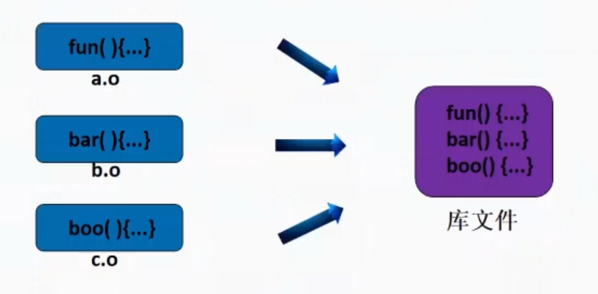

# 库文件

由编译生成的.o文件生成



## 静态库

### 概念

- 将多个目标文件打包成一个文件

- 链接静态库就是将库中被调用的代码复制到调用模块中

- 静态库的拓展名是.a 例如libxxx.a	

### 使用

如我实现了 calc.c calc.h  show.c show.h   两个功能

- 通过分别编译生成了calc.o show.o
- 使用 ar -r libmath.a calc.o show.o 

将两个功能用到main主模块中

- 编译 gcc main.c libmath.a

- 注意必须加上libmath.a ，否则会报错，找不到calc.h,show.h里面的函数声明

- 当 “.h” 文件过多时可以将“.h”文件声明写入一个math.h里面

  ```c
  
  //接口文件
  #ifndef __MATH_H_
  #define __MATH_H_
  include"calc.h"
  include"show.h"
  
  #endif // __MATH_H_
  ```

当libmath.a在其他目录下的编译方法

- gcc -lmath -L.. // 例如libmath.a在上一级目录
- -l后面跟名称 -L后面跟路径

或者将指定库的路径配置到LIBRARY_PATH环境变量里

- export LIBRARY_PATH=$LIBRARY_PATH:..
- gcc main.c -lmath

### 优点

- 运行速度快
- 不需要依赖
- 版本迭代不方便

### 缺点

- 生成的a.out大

## 动态库

### 概念

- 动态库和静态库不同，链接动态库不需要将被调用的函数代码复制到包含调用代码的可执行文件中，相反链接器会在调用语句处嵌入一段指令，在该程序执行到这段指令时，会加载该动态库并寻找被调用函数的入口地址并执行之。
- 如果动态库中的代码同时为多个进程所用，动态库在内存的实例仅需一份，为所有使用该库的进程所共享，因此动态库亦称共享库。
- 动态库的拓展名是.so 例如libxxx.so

### 使用

以构建数学库为例，动态库的构建顺序如下：

1.编辑库的实现代码和接口声明

- 计算模块： calc.h、calc.c
- 显示模块：show.h、show.c
- 接口文件：math.h

2.编译成目标文件

- gcc -c -fpic calc.c
- gcc -c fpic show.c

3.打包成动态库

​	注意需要提前配置环境变量LD_LIBRARY_PATH,如LD_LIBRARY_PATH=￥LD_LIBRARY_PATH:.。这个是动态库链接器的路径配置,链接器在a.out执行过程中找库文件。别忘了把它变成全局的，执行export LD_LIBRARY_PATH。

​	否则当执行下面命令编译成功后生成a.out文件，再执行a.out文件时会报错<找不到libmath.so>。

- gcc -shared calc.o show.o -o libmath.so // 生成动态库
- gcc main.c libmath.so  // 默认生成a.out
- gcc main.c libmath.so -o main // 想起个名就用这个

### PIC

## 

### 优点

- 方便版本迭代与程序的维护
- 生成的a.out小

### 缺点

- 运行比静态库慢，但也不是太慢

- 依赖库文件

# 几个重要的环境变量

LD_LIBRARY_PATH                      链接器a.out执行过程中找库

LIBRARY_PATH                               GCC编译阶段找库

PATH                                                 bash找命令的

# 关键字补全

vim/vi偷懒秘诀

Ctrl + N

# 防止重复引用

```c
//接口文件
#ifndef __MATH_H_
#define __MATH_H_
//在这三句中间加入头文件即可，防止重复引用
include"calc.h"
include"show.h"

#endif // __MATH_H_
```

