# 为什么宏之间可以用 “|” 而不用 “||”？ 

​	因为，宏的本质是一个数。

# 文件锁的内核结构

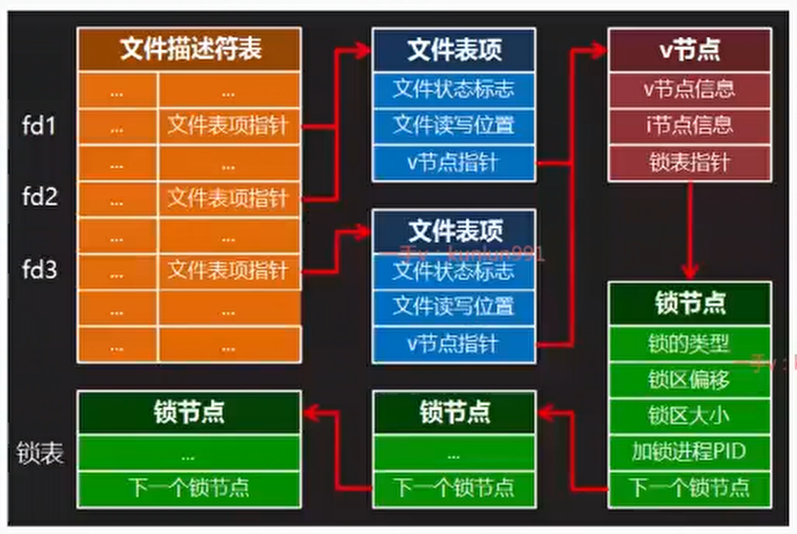

# 访问测试

## access

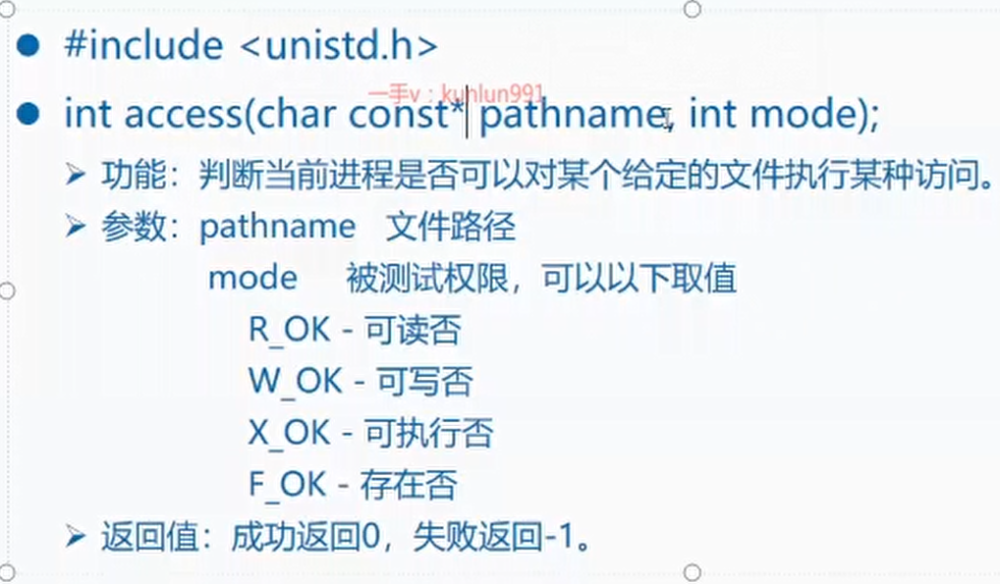

# 修改文件大小

## truncate

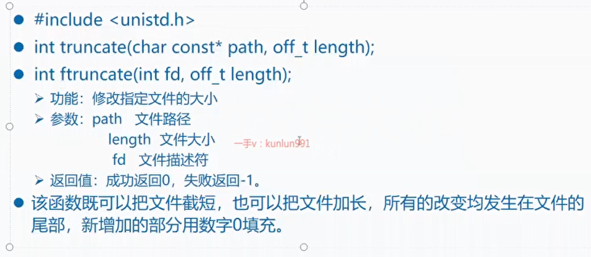

保存文件后，会自动给文件尾添加\n

# 文件的元数据

## stat

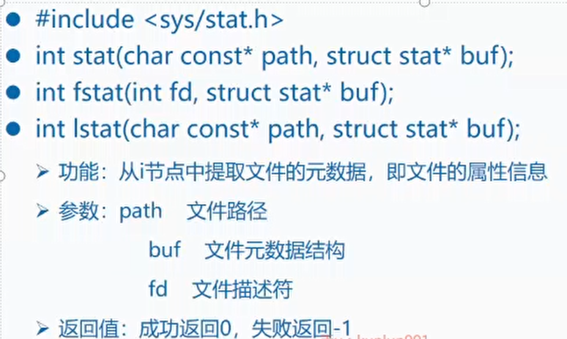

### stat结构体

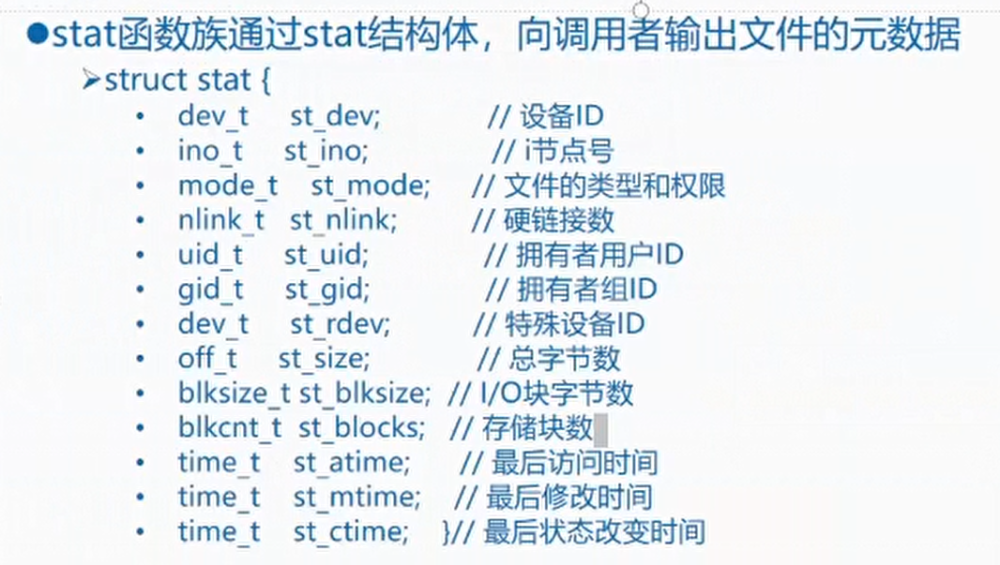

- stat结构的st_mode成员表示文件的类型和权限,该成员在stat结构中被声
  明为mode_t类型,其原始类型在32位系统中被定义为unsigned int,即32位
  无符号整数,但到目前为止,只有其中的低16位有意义

- 用16位二进制数(B15 ... B0)表示的文件类型和权限,从高到低可被分为五组

  >B15-B12:文件类型
  >B11-B9:设置用户ID,设置组ID,粘滞
  >B8-B6:拥有者用户的读、写和执行权限
  >B5-B3:拥有者组的读、写和执行权限
  >B2-BO:其它用户的读、写和执行权限

## 文件元数据结构

### B15-B12

​	这4个bit表示文件的类型

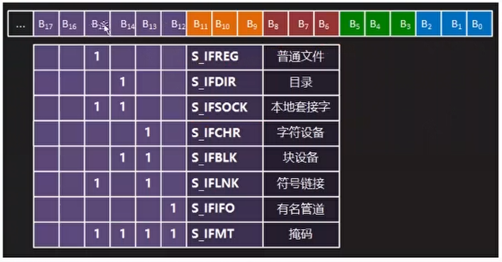

### B8-B6

 这3个bit表示拥有者用户的读，写和执行权限

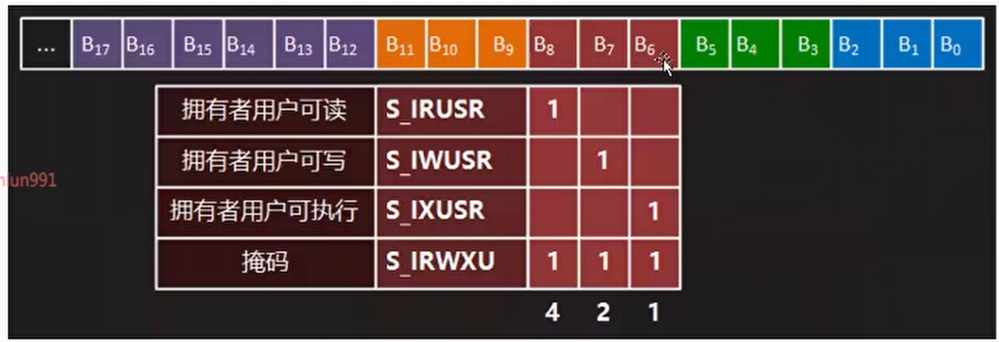

### B5-B3

​	拥有者组的读，写，执行权限

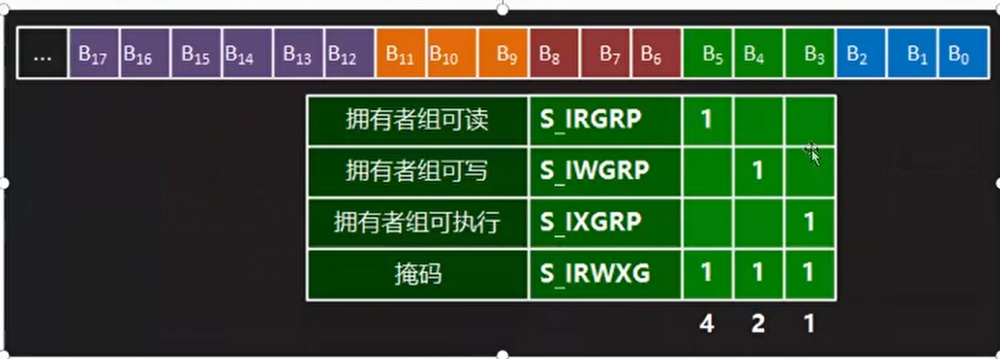

### B2-B0

 其他用户的读，写和执行权限

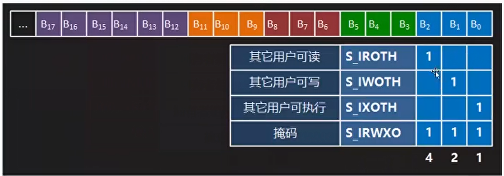

### B11-B9

​	设置用户ID，设置组ID和粘滞

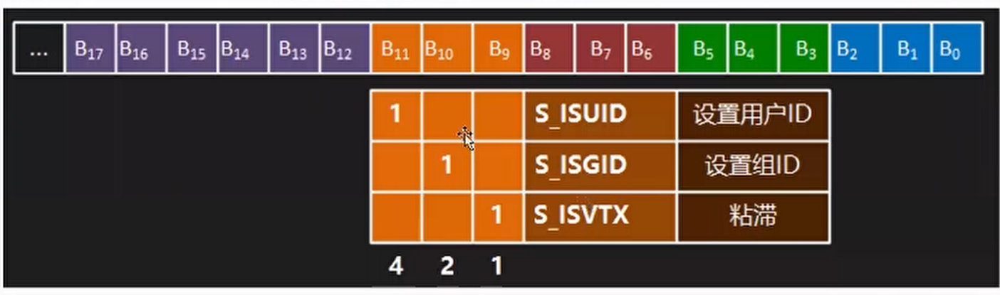

## 文件用户ID

​	如果设置了用户ID位，则有效用户ID为文件的所有者

​	如果没有设置用户ID位，则有效用户ID为实际正在使用的用户ID

### 有效用户ID

​	有效用户ID决定了该进程的使用权限，进程的有效用户ID为root，肯动比普通用户所能用到的资源更多。比如有些操作需要以管理员身份运行。

- 系统管理员常用这种方法提升普通用户的权限,让他们有能力去完成一些本来只有root用
  户才能完成的任务。例如,他可以为某个拥有者用户为root的可执行文件添加设置用户
  ID位,这样一来无论运行这个可执行文件的实际用户是谁,启动起来的进程的有效用户
  ID都是root,凡是root用户可以访问的资源,该进程都可以访问。当然,具体访问哪些
  资源,以何种方式访问,还要由这个可执行文件的代码来决定。作为一个安全的操作系统
  不可能允许一个低权限用户在高权限状态下为所欲为。如通过passwd命令修改口令
- 带有设置用户ID位的不可执行文件:没有意义。
- 带有设置用户ID位的目录文件:没有意义。

## 粘滞位

- 带有粘滞位(B9)的可执行文件,在其首次运行并结束后,其代码区被连续地保存在磁盘交换区中,而一般磁盘文件的数据块是离散存放的。因此,下次运行该程序可以获得较快的载入速度
- 带有粘滞位(B9)的不可执行文件:没有任何意义
- 带有粘滞位(B9)的目录:除root以外的任何用户在该目录下,都只能删除或者更名那些属于自己的文件或子目录,而对于其它用户的文件或子目录,既不能删除也不能改名,如/tmp目录

## 用户ID位和粘滞位与执行权限

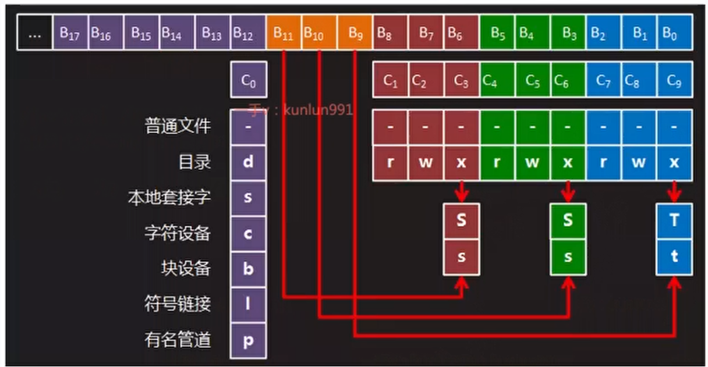

- 如果设置了对应的ID位，则对应的x由对应的字母替换，大写字母没有执行权限，小写字母有执行权限。
